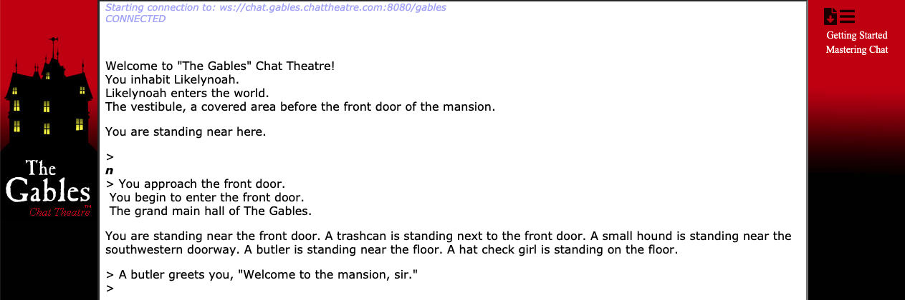

# Logging Into the Gables

There's a simple text game online called [The Gables](https://gables.chattheatre.com/). It's a tiny little text stage that you can look around in. There's not a lot of built-in game. It's just a place to show up, make a character and look around.

Which means it's the perfect place to understand what a SkotOS game is before you install a bunch of software, and without a game pushing you to do ***fun*** things with ***other people***. If you wanted that then you'd pick a real SkotOS game &mdash; [Castle Marrach](https://www.marrach.com/), [The Eternal City](https://www.eternalcitygame.com/), [https://allegoryofempires.com/](https://allegoryofempires.com/), [Multiverse; Revelations](https://home.multirev.net/).

But if you just want to see what a SkotOS game ***is***, The Gables is a fine choice.

