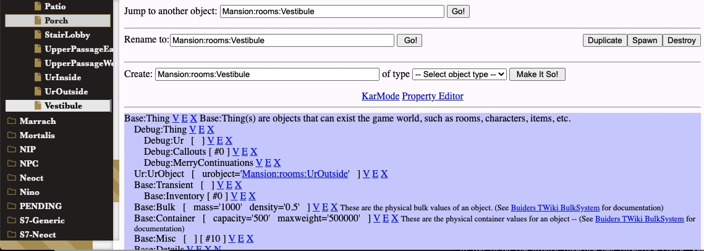
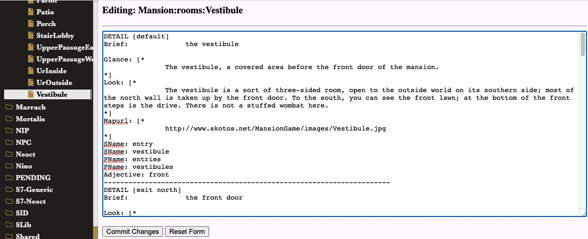
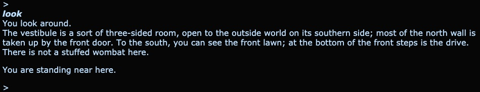

# Your First Week: WOE Editing

The Tree of WOE is your basic editor of in-game objects. If you want to create new locations or new props, that should be your first stop.

So let's get started.

(Before you do this, make sure you have The Gables [running locally](../setup.md) or [on a VPS](../setup_vps.md) and that you can connect to the Tree of WOE from your auth server's web pages.)

## Changing a Room

Let's find our start room, the one you're probably standing in.

The list on the left is a set of nested categories. We'll be looking for Mansion:rooms:Vestibule. So start by looking for "Mansion", and inside that you should find "rooms" and then "Vestibule". And that's the starting room for new characters in The Gables, such as (presumably) yourself.

The default editing interface is opaque and a bit clunky. Let's go to KarMode, which is easier for just changing the text of the room. It renders the room's properties as a sort of MarkDown-like format that represents it. You change the markdown and then that changes the object.

Hit "KarMode" in WOE and you should see something like this:

You'll notice that the text on ***yours*** does not include the phrase "there is not a stuffed wombat here." I think that's an unfortunate omission. Go ahead and add it. Or anything else you feel like &mdash; it's your game, after all.

After you've added what you want to, hit the "Commit Changes" button at the bottom, which should bring you back to the WOE interface.

Now open a new Chrome window to localhost:2072 or your gables-login URL, log in and hit "Play". If you've moved away from the Vestibule, head back to it now.

You may need to type "look" to see your changes to the room description. But once you've changed them in the Tree of WOE, you don't need to do anything beyond hitting "Commit". Look again and the changes should be there. That's a lot more satisfying than messing with XML files and rebooting.

Of course, if you delete skotos.database and do a full cold boot you'll ***lose*** those changes. We'll talk about how to fix that later. For right now, just know: there's an extra step if you want to export your changes to XML and share them with other people, or persist them through a reboot with no statedump.
