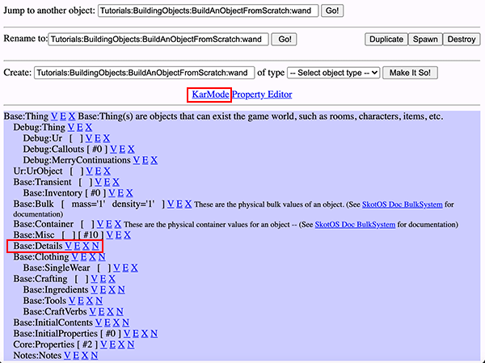
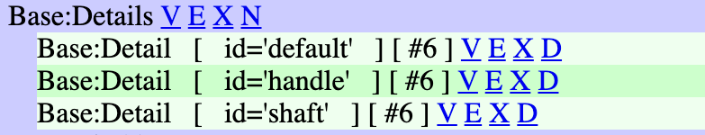

# Building an Object from Scratch

For this tutorial, we will focus on the basics of creating an object from scratch. The process of creating any object can be broken down into three steps.

1. Create the object
2. Add details and descriptions
3. Configure settings

I will be building a wand in this example but feel free to create whatever type of object you want as you follow along. The completed object I am building can be found in `Tutorials:BuildingObjects:BuildAnObjectFromScratch:wand`.

## Step 1: Create the object

To create an object from scratch, use the +cobj command. The syntax for the command is as follows:

```
+cobj syntax:
+cobj action         Tavern:coders:skott:myAction
+cobj helpnode       Tavern:coders:skott:myHelpnode
+cobj object         Tavern:coders:skott:myObject
+cobj propcontainer  Tavern:coders:skott:myPropcontainer
+cobj verb           Tavern:coders:skott:myVerb
```

This command is fairly straightforward and the only question you need to ask yourself is where do you want to save the object? The command will give you a suggestion but you can use anything you want. However, you should avoid using spaces or special characters, and do not save anything in the root directory. 

If you are the only one using the server, something like 'Props:wand' would be fine. However, it can get confusing if you have multiple people creating props. You may want to establish a universal naming convention for how objects should be stored, and you may also want to incorporate a QA process before objects go live on your server. For example, 'Props:unreviewed:wand' would be a suitable location for objects waiting to be reviewed, but even better would be a folder with your character name + props:unreviewed:wand. Then once the object is reviewed and ready to go live, it can be moved to the appropriate place.

`+cobj object wand` = saved to root directory = BAD

`+cobj object Sarah:props:unreviewed:wand` = saved to "Sarah:props:unreviewed" folder = GOOD


So let's go ahead and create our object.

```
+cobj object Sarah:props:unreviewed:wand
Done! [V] [E] [X] [MStamp]
```


If all goes well, you will see the above "Done!" message followed by four hyperlinks.

* V = This link will open a popup window of the newly created WOE object in view mode.
* E = This link will open a popup window of the newly created WOE object in edit mode.
* X = This link will open a popup window of the newly created WOE object's XML code (because all SkotOS objects are essentially XML files). Unless you are experienced with working in XML, I would avoid modifying an object this way.
* MStamp = This link runs a script that creates a #list# property in the object with summaries of all Merry scripts that exist in that object. If you have snooped around WOE, you may have come across these properties in objects like Lib:common. This isn't something we will be using for this tutorial.

Now that your object is created, go ahead and click the `[V]` link. You will see something similar to:


## Step 2: Add details and descriptions

To add details and descriptions, there are two areas we need to focus on.



### KarMode

Click on KarMode and it will open a window with a big, empty input box. This is where we will list all the details along with their descriptions, snames, pnames, and adjectives. For the wand, I will have three details: **default**, **shaft**, and **handle**. 

All objects have a **default** detail. This is the detail that contains the overall description for an object and needs to be flagged as *prime* in Base:Details. It should reference the other details of the object so users know those details exist and can be interacted with. A general rule of thumb is if a detail is mentioned in the default description, it should be added as a detail in KarMode. For example, a default car description that references wheels should also have a wheel detail with its own descriptions.

#### Brief
The brief of an object is a short description of an object--it's what you see when interacting with it.

```
Brief: simple wooden wand
```

    > hold my wand
    You hold your **simple wooden wand**.

#### Look
The look is the description you see when *looking* at an object. *Looks* are not overly descriptive and include only the information one might notice from a cursory glance.

```
Look: A simple wooden wand fashioned from a branch.
```

    > look at my wand
    You look at your simple wooden wand
    **A simple wooden wand fashioned from a branch.**

#### Examine
The examine is the description you see when *examining* an object. *Examines* are descriptive and include information one might notice from studying an object closely.

```
Examine: Hand-carved from a sturdy oak branch, this simple wand is comprised of a handle and shaft. The bark has been cleanly stripped from the wood leaving just a little behind for the grip.
```

    > examine my wand
    You examine your simple wooden wand.
    Hand-carved from a sturdy oak branch, this simple wand is comprised of a handle and shaft. The bark has been cleanly stripped from the wood leaving just a little behind for the grip.

#### SName
All objects can have a list of one or more SNames (*singular name*). These are the keywords the parser uses to target the object.

```
SName: wand
SName: weapon
```

If no SName is listed, the object *cannot* be targeted at all.

#### PName
PNames are simpley the plural version of SName. They are what allow you to target multiple objects at once.

```
PName: wands
PName: weapons
```

    > juggle my wands
    You juggle your two simple wooden wands.

#### Adjectives
An object's adjectives assist with targeting, such as if you want to differentiate between a wooden wand and metal wand.

```
Adjective: hand-carved
Adjective: oak
Adjective: wimple
Adjective: wooden
```

    > grab my wand
    You must choose between your simple wooden wand or your plain metal wand.

    > grab my wooden wand
    You grab your simple wooden wand.


See also: [The Description System - A Technical Summary](../In-Game_Systems/DescriptionSystem.md).


My finished KarMode descriptions:

```
DETAIL [default]
Brief: simple wooden wand
Look: A simple wooden wand fashioned from a branch.
Examine: [*
  Hand-carved from a sturdy oak branch, this simple wand is comprised of a handle and shaft. The bark has been cleanly stripped from the wood leaving just a little behind for the grip.
*]
SName: wand
PName: weapon
PName: wands
PName: weapons
Adjective: hand-carved
Adjective: oak
Adjective: wimple
Adjective: wooden
----------------------------------------------------------------------
DETAIL [handle]
Brief: the handle of a simple wooden wand
Look: The handle is thick and covered in rough bark.
Examine: [*
  The thick, oak handle is made from the bark that has been left on the branch. It is worn in places due to frequent use.
*]
PName: handle
PName: handles
Adjective: wand
Adjective: weapon
Adjective: hand-carved
Adjective: oak
Adjective: rough
Adjective: wooden
----------------------------------------------------------------------
DETAIL [shaft]
Brief: the shaft of a simple wooden wand
Look: The shaft is smooth and comes to a tapered point.
Examine: [*
  The bark has been stripped from the shaft of the wand revealing the smooth, pale colored oak wood beneath.
*]
SName: shaft
PName: shafts
Adjective: wand
Adjective: weapon
Adjective: hand-carved
Adjective: oak
Adjective: smooth
Adjective: wooden

```

Now that our details are added, we need to do further configurations in Base:Details to finish this step.


### Base:Details



Base:Details will now have all the details that you added in KarMode. Each will have V, E, X, and D link.

* V - View this detail
* E - Edit this detail
* X - Edit this detail in XML (not advised)
* D - Delete this detail. It is not possible to delete details in KarMode so that has to be done here.

Click 'E' next to the default detail. We need to flag this detail as the *prime* detail and then "Submit Changes" at the bottom of the page.


You may have noticed by now that articles (a/an) are automatically added to the front of briefs. Sometimes, like in the case of our handle and shaft details, we don't want to do this. To disable this, we need to flag these details as *definite*. To do so, click the 'E' to edit the detail, and find the definite check box near the top of the page.


Once you have finished fine tuning your details, this step will be complete.

## Step 3: Configure settings

For this final step, we need to configure our final settings. In the case of our wand, we need to look at Base:Bulk and Base:Misc. If we were setting up a container, we would do that in this step too under Base:Container.


### Base:Bulk

All objects need to have their bulk settings adjusted. This could cause issues with objects appear *too big* to fit in containers or *too heavy* to carry. For reference help, see: [Mass Values](../SkotOS_Objects/Object_Types/Standard_Object/MassValues.md) and [Density Values](../SkotOS_Objects/Object_Types/Standard_Object/DensityValues.md).


### Base:Misc

We want the wand to be flagged as a weapon on the server, so we need to check the appropriate box under Base:Misc.


Now we will be able to *wield* our wand!

## Final Thoughts

All objects should go through an extensive QA process before releasing to the public. At the very least, have someone else do a quick once over to check for typos or other settings you may have missed.

The finished prop I created can be found here 'Tutorials:BuildingObjects:BuildAnObjectFromScratch:wand'.
