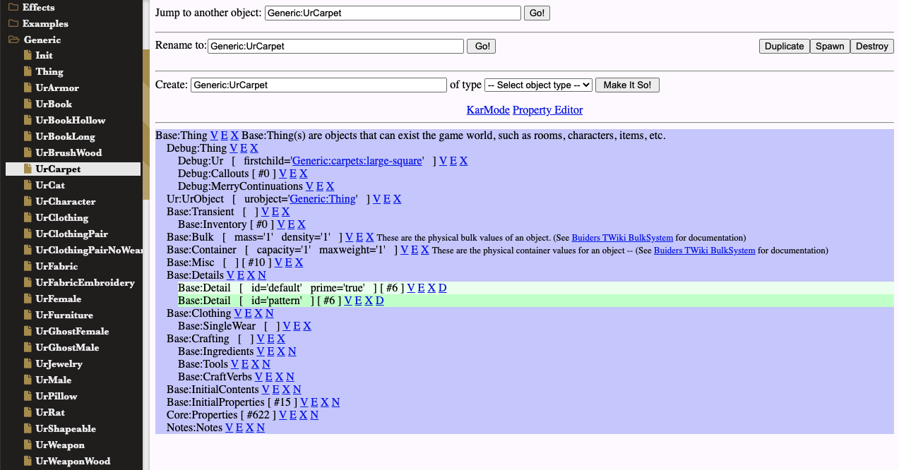

# SkotOS WOE Objects and Workflow

SkotOS has a few different types of objects. This document will discuss your workflow around one specific type, which are called WOE objects.

WOE objects are, very roughly, "in-game objects that are kept in server memory." While this page has a lot of caveats, exceptions and general nit-picking, the basic concept of a WOE object is just that. Is there an anvil on the floor in a room? It's a WOE object. The room? Also a WOE object. Your body? WOE object.

## SkotOS Object Types and WOE

SkotOS has a few different places it puts code and data structures. Let's talk about what WOE objects are, specifically.

* Files - some things in SkotOS are just files, like in non-SkotOS apps. While WOE objects can interact with files and can be dumped to XML, a "live" WOE object is in memory in the DGD server.
* Source code - the .c and .h files are source code in the DGD language. Compiled DGD objects are often "off-stage" - they exist but you can't necessarily see them or directly interact with them. A compiled source object can choose to be a WOE object, but many (most?) of them aren't.
* In-game objects - all in-game objects like rooms, player bodies or props are WOE objects, though not all WOE objects are visible in-game objects.

WOE objects live in a WOE namespace. For instance, your top-level Theatre object might be named Theatre:Theatres:Tavern. Or the basic tall male body might be named Mansion:MaleTall1, as it is for The Gables. The parts before the colon are often directories when saving WOE objects on disk, and are categories visible on the left side of the Tree of WOE UI &mdash; see below.

## WOE and Ur-Objects

WOE Objects have the possibility of inheriting from an "Ur" object. Wikipedia says of the word "UR": *Ur-, a German prefix meaning "primeval" (seldom also "primitive") or even simply "original"; in a relative majority of cases it takes on the sense of "most ancient" (referring to sth. as a 'source' - the initial root, the starting point - of a development); Compare with Old English: or-deal, or-lay, or-iginal; in modern English often replaced by 'proto-'; Sometimes in combinations of two or more of these meanings.*

An "Ur" object is like a parent object. It is especially similar to a JavaScript parent object since JS uses [prototypal inheritance](https://developer.mozilla.org/en-US/docs/Web/JavaScript/Inheritance_and_the_prototype_chain), like SkotOS does.

Basically, you can have a beer, which can be an instance of the "Ur-beer," the parent object. The Ur-beer isn't usually sitting around in the world. That's good, because if you drank it then it would empty all the other beers in the world! They inherit their "full" state from the Ur-beer. An object you see in the world can often be an *instance* of a parent object, and any object can inherit its properties (data) from an Ur-object.

## Seeing and Editing WOE Objects

The easiest way to see (nearly) all the WOE objects is the Tree of WOE. If you have a developer or staff account on a production SkotOS login server (a.k.a. thin-auth), it will have a Tree of WOE link. You may also have a Tree of WOE link on your local development machine, though sometimes the link is broken. The link you want for local dev will look something like "http://localhost:10080/gables/TreeOfWoe.html".

The Tree of WOE lets you look through the hierarchical table of all the WOE objects on the left, and when you click on one of them you can view and edit it on the larger right pane.

Properties will have letters in brackets after their name for things like [V]iew, [E]dit and [X]delete.

## WOE Objects in XML Form

WOE objects have a standard XML representation. You can find them in [the SkotOS repository](https://github.com/ChatTheatre/SkotOS) under skoot/data/vault, for instance. They're a bit verbose, but you can usually get a feel for what's going on by reading one.

When we turn WOE objects into files or vice versa, the files are basically always in that same XML format.

Many WOE objects can be saved and loaded this was, but watch out: an object that is basically made of DGD source code (.c and .h files) and is only ***exposing a WOE interface*** isn't going to work well if saved and loaded. Since it's not "just" a WOE object, you'll have trouble saving and loading only the WOE parts.

## WOE and Merry

WOE objects can contain scripts in a DGD-like sub-language called Merry (or MERRY.) Merry can be used to dynamically generate descriptions (e.g. what an object looks like in game) or reactions (e.g. what an object does when you enter the room with it.) Merry is usually written as properties on a WOE object whose name begins with "merry:". If the name begins with "merry:inherit:" then the script is inherited from a parent (Ur) object instead.

## WOE Objects on a Live Persistent Server

For most of SkotOS history, the idea was that you kept your WOE objects in memory in DGD. It was possible to export them and mess with them a little, but the normal, natural location for a WOE object was in memory. Where they were saved, it was usually in a DGD statedump, which contained all the objects in the server's memory.

If you're an old programmer, the concept is very similar to a SmallTalk VM image - if the normal, natural place for an object is in memory then you can mess with them and the edits will persist. Want to change the name? Don't mess with a text editor, just change the name in the editing UI.

Doing it this way makes it easy for non-programmers to play with objects on the live server... And harder for programmers to exchange their changes via source code files.

One oddity of a persistent server is that it may not be possible to export a persistent-server object to a different server. That object may have been created by editing it in stages. It may not have "cold" startup code, and it may never have been loaded into memory before every part of the running game was in place and working. In other words, there may not be a full list of instructions available to go from "this object doesn't exist" to "this object is running and fully integrated with all the server systems it needs."

## Saving and Loading WOE Objects

One way to save and load WOE objects is the Vault Tool. You can read about using it to save whole namespaces of WOE objects, or load them, or delete them [in the article on Exploring SkotOS](../Developer/Exploring_SkotOS.md#dumping-lpc-objects-on-the-gables).

The vault tool gives a developer-friendly way to turn WOE objects into directories of files, and to load directories of files back into memory as WOE objects.

## Vaults

In old SkotOS, the WOE objects were divided into Vaults. While all WOE objects can mingle in memory and talk to each other, most of them are "native" to a vault somewhere. A Vault allowed saving or loading groups of objects, and would know which objects should be excluded from a sync (e.g. some objects are mostly made of DGD code and importing them makes no sense.)

## The Sync System

Even without programmers exchanging code on GitHub, you'd still want to offer your changes to other games. Somebody might build a patterned vest in Lovecraft Country and let the Castle Marrach people wear one. How did that work?

There was a [Sync System](./SyncSystem.md) for changes like that. It was complicated, and now seems disused. The basic idea was that in-memory WOE objects could be serialised, copied to a new server, and then be added to the new server, possibly replacing other objects that were already there.

## Starting Up with WOE Objects

For the first 20 years, a SkotOS server was basically always persistent &mdash; they didn't really shut down and reload. They just statedumped and later continued, even while upgrading the source code, data and objects in memory. DGD is pretty cool that way.

But with the advent of [ChatTheatre's open-source SkotOS](https://github.com/ChatTheatre/SkotOS) it became possible to have a "cold-boot SkotOS," a game that was designed to be possible to shut down and fully reload, like most applications in most languages work. This changed a few things about how WOE objects worked.

New SkotOS assumes you'll have a lot of WOE objects, usually under /data/vault, and they'll be loaded when you start up your game. The same objects can be loaded using things like the vault tool, of course.

This is a lot friendlier to programmers exchanging files. But it means there's a bit of difficulty with two-way sync: if you have XML files on disk but then you edited them in the Tree of WOE, the two won't agree. And there are small changes that can accumulate, so a simple file diff may not work very well...

So how do we deal with all that?

## Diffing XML Files and Directories?

If you have a directory of WOE XML files and a server with WOE objects in memory, usually that means the in-memory version is more up-to-date. You can dump it with the vault tool to get a new, more up-to-date directory of WOE XML files. If you want to archive those are give a copy to somebody else, now you have XML files that work for that.

What if it's not that simple? What if things have changed in more than one place? That's when we need to compare multiple directories of XML files...

In [DGD Tools,](https://github.com/ChatTheatre/dgd-tools) there is a skotos-xml-diff utility that will diff two XML objects, or two directories full of XML objects, while ignoring most trivial differences (e.g. comments on the revision history, comments on the time and server the file was generated, whitespace differences.)

If you want to search through ***just*** the interesting differences, you can "skotos-xml-diff vault1 vault2" and get a full diff between them. You can also use --ignore-whitespace or --merry-only to see only certain kinds of diffs. You can use --ignore-types to give a list of XML node types ***not*** to include in the output.
